# Курсовая/Лабораторные работы для теории формальных языков и компиляторов
## Лабораторная работа №1 : Разработка пользовательского интерфейса (GUI) для языкового процессора
**Цель работы:** Создание кроссплатформенного графического интерфейса (GUI) для языкового процессора в виде специализированного текстового редактора.

**Автор:** Чернышев Родион **группа:** АВТ-314

**Описание проекта:** Данное приложение является пользовательским интерфейсом (GUI) для языкового процессора, оно было создано с помощью WindowsForms на MicrosoftVisualStudio с использованием языка программирования Csharp. 

Интерфейс программы включает все требуемые компоненты:
- Главное меню с разделами "Файл", "Правка", "Текст", "Пуск", "Справка"
- Панель инструментов с кнопками быстрого доступа
- Область ввода/редактирования текста (RichTextBox)
- Область вывода результатов (DataGridView)

**Используемые технологии:**

| Компонент | Технология |
|-----------|------------|
| Язык программирования | C# |
| Фреймворк для GUI | .NET Windows Forms |
| Среда разработки | Microsoft Visual Studio 2019 |
| Версия .NET | .NET Framework 4.7.2 / .NET 6.0 |
| Операционная система | Windows 10/11 |

**Инструкция по сборке и запуску:**

1. Открыть решение `GUIshka.sln` в Visual Studio
2. Выбрать конфигурацию сборки `Release`
3. Выполнить сборку проекта: **Сборка** → **Собрать решение** (или `Ctrl+Shift+B`)

**Готовый исполняемый файл:** GUIshka/bin/Release/GUIshka.exe

**Описание интерфейса и функций (руководство пользователя):**

При запуске приложения можно будет увидеть поле для ввода, поле для вывода, панель быстрого доступа, а так же меню дня управления приложением.


1. Кнопка для создания нового документа
2. Кнопка открытие документа
3. Кнопка сохранение текущих изменений в документе
4. Кнопка отмена изменений
5. Кнопка повтор последнего изменения
6. Кнопка копировать текстовый фрагмент
7. Кнопка вырезать текстовый фрагмент
8. Кнопка вставить текстовый фрагмент
9. Кнопка запуск синтаксического анализатора
10. Кнопка вызов справки - руководства пользователя
11. Кнопка вызов информации о программе

При нажатии на пункт меню "Файл" откроется подменю, где можно создать, открыть, сохранить и файл, а так же выйти из проложения.

<p align="center"></p>

При нажатии на пункт меню "Правка" откроется подменю, где можно произвести разного рода действия с кодом.

<p align="center"></p>

При нажатии на пункт меню "Текст" откроется подменю, где можно посмотреть все для текста кода.

<p align="center"></p>

При нажатии на пункт меню "Пуск", приложение выполнит код и покажет в панеле вывода ошибки, если они будут.

<p align="center"></p>

При нажатии на пункт меню "Справка" откроется подменю, где можно посмотреть сведения о программе.

<p align="center"></p>

**Ограничения:**
1. Функциональные ограничения:
- Реализован только дизайн интерфейса, логика обработки событий не подключена
- Отсутствует реальная функциональность языкового процессора
- Кнопки панели инструментов не обрабатывают события нажатия
2. Технические ограничения:
- Приложение работает только на операционных системах Windows
- Требуется установленный .NET Framework / .NET Runtime
- Отсутствует поддержка горячих клавиш

## Лабораторная работа №2 : Разработка лексического анализатора (сканера)
**Цель работы:** Изучить назначение и принципы работы лексического анализатора в структуре компилятора. Спроектировать алгоритм (диаграмму состояний) и выполнить программную реализацию сканера для выделения лексем из входного текста. Интегрировать разработанный модуль в ранее созданный графический интерфейс языкового процессора.

**Постановка задачи:** Разработать лексический анализатор (сканер) в соответствии с индивидуальным вариантом задания, интегрировать его в приложение из лабораторной работы №1 и обеспечить вывод результатов.

**Требования к лабораторной:**

Требования к реализации сканера:
1. Спроектировать диаграмму состояний конечного автомата, реализующего сканер, согласно варианту задания.
2. Разработать программный модуль лексического анализа, который:
    - принимает на вход строку (исходный текст программы);
    - выделяет все допустимые лексемы согласно варианту;
    - классифицирует лексемы по типам (например: "ключевое слово", "идентификатор", "число", "оператор", "разделитель").
    - любые символы, не соответствующие ни одному из допустимых типов лексем, считать недопустимыми и выводить сообщение об ошибке с указанием позиции.
    - учитывает многострочность входного текста.

Требования к интеграции и интерфейсу:
1. Встроить сканер в ранее разработанный интерфейс и связать его с кнопкой "Пуск" и соответствующим пунктом меню.
2. Область вывода результатов (элемент DataGridView или аналогичная таблица) должна содержать следующие столбцы:
    - Условный код (числовой идентификатор типа лексемы).
    - Тип лексемы (текстовое описание).
    - Лексема (выделенная подстрока).
    - Местоположение (номер строки, начальная и конечная позиция символов).
3. Реализовать навигацию по ошибкам: при щелчке на сообщении об ошибке в таблице результатов курсор в области редактирования должен устанавливаться на позицию недопустимого символа.

Входные и выходные данные:
1. **Вход:** строка (текст программного кода), введенная пользователем в область редактирования.
2. **Выход:** таблица, содержащая последовательность условных кодов и описаний лексем. Пример для строки "int x=123;":

| Условный код | Тип лексемы | Лексема | Местоположение |
|-----------|------------|------------|------------|
| 14 | ключевое слово | int | строка 1, 1-3 |
| 11 | разделитель (пробел) | (Пробел) | строка 1, 4-4 |
| 2 | идентификатор | х | строка 1, 5-5 |
| 10 | оператор присваивания | = | строка 1, 6-6 |
| 1 | целое без знака | 123 | строка 1, 7-9 |
| 16 | конец оператора | ; | строка 1, 10-10 |

**Вариант задания №3 Объявление комплексного числа с инициализацией на языке Python**

Примеры коректных входных строк:

1. Базовое объявление

```z3 = complex(0, 2.5);```

2. Разные имена и значения

```complex_num_1 = complex(10, 3.14159);```

3. Многострочный код с несколькими объявлениями

```
z1 = complex(0, 1.5);
z2 = complex(2, 3.0);
z3 = complex(4, 5.75);
```

Перечень допустимых лексем:

<p align="center">
  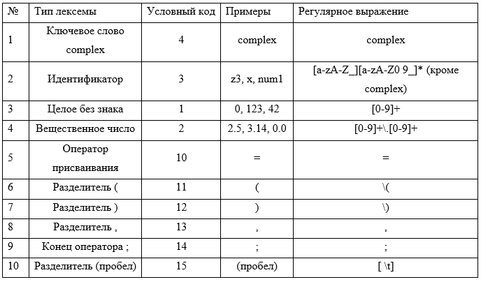
</p>

**Диаграмма состояний:**

<p align="center">
  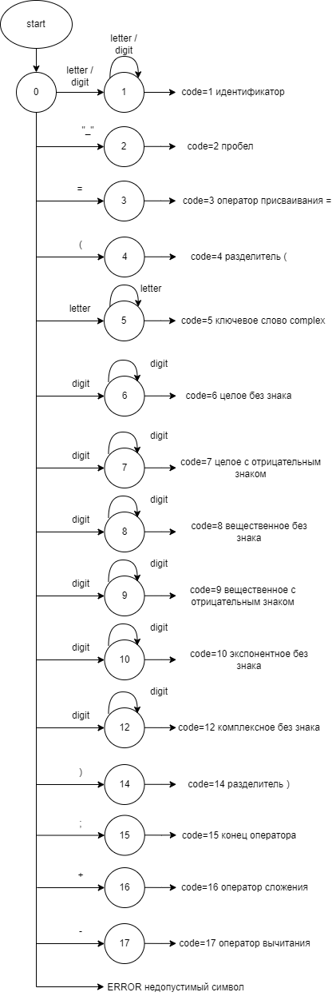
</p>

**Краткое описание работы автомата:**

1. Начальное состояние (СТАРТ): Автомат ожидает первый символ новой лексемы. В зависимости от символа происходит переход:
    - Пробел/табуляция → фиксируется лексема-разделитель, возврат в СТАРТ
    - Цифра → переход в состояние "В ЧИСЛЕ"
    - Буква или подчеркивание → переход в состояние "В ИДЕНТИФИКАТОРЕ"
    - Символ '=' → фиксируется оператор присваивания
    - Символы '(', ')', ',', ';' → фиксируются как соответствующие разделители
    - Любой другой символ → фиксируется как ошибка
2. Состояние "В ЧИСЛЕ": Автомат накапливает цифры целой части числа
    - Цифра → остаемся в состоянии "В ЧИСЛЕ"
    - Точка '.' → переход в состояние "В ДРОБНОЙ ЧАСТИ"
    - Любой другой символ → завершаем формирование целого числа, возврат в СТАРТ с повторной обработкой символа
3. Состояние "В ДРОБНОЙ ЧАСТИ": Автомат накапливает цифры после точки
    - Цифра → переход в состояние "ВЕЩЕСТВЕННОЕ ЧИСЛО"
    - Любой другой символ → ошибка (число заканчивается точкой)
4. Состояние "ВЕЩЕСТВЕННОЕ ЧИСЛО": Автомат накапливает цифры дробной части
    - Цифра → остаемся в состоянии "ВЕЩЕСТВЕННОЕ ЧИСЛО"
    - Любой другой символ → завершаем формирование вещественного числа, возврат в СТАРТ с повторной обработкой символа
5. Состояние "В ИДЕНТИФИКАТОРЕ": Автомат накапливает символы идентификатора
    - Буква, цифра или подчеркивание → остаемся в состоянии
    - Любой другой символ → завершаем формирование идентификатора, проверяем, не является ли он ключевым словом complex, возврат в СТАРТ с повторной обработкой символа

**Тестовые примеры:**

1. Корректная строка

Входная строка: ```z3 = complex(0, 2.5);```

Выходная последовательность:

<p align="center">
  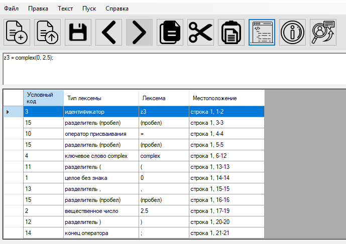
</p>

2. Строка с недопустимым символом

Входная строка: ```z3 = complex(0, 2.5);@```

Выходная последовательность:

<p align="center">
  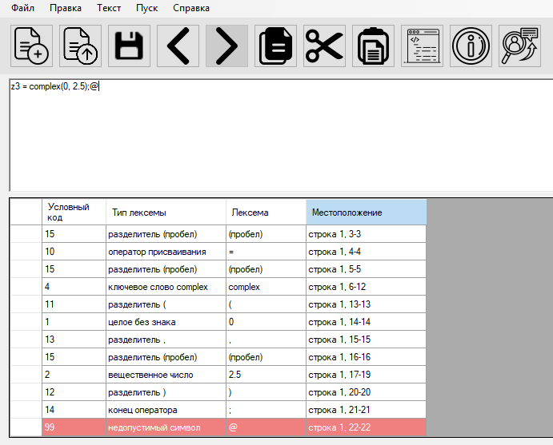
</p>

3. Многострочный пример

Входная строка:

```
z1 = complex(0, 1.5);
z2 = complex(2, 3.0);
z3 = complex(4, 5.75);
```

Выходная последовательность:

<p align="center">
  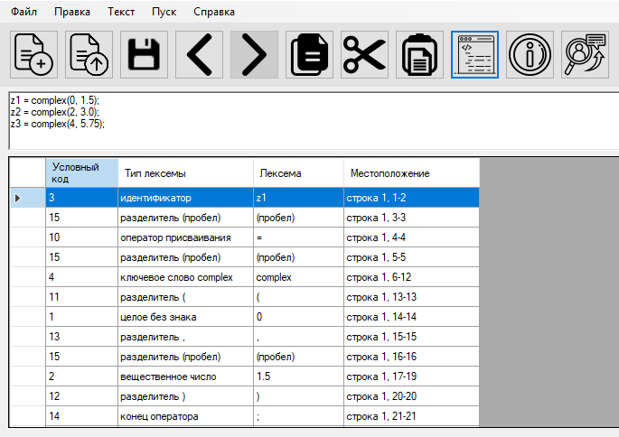
</p>

<p align="center">
  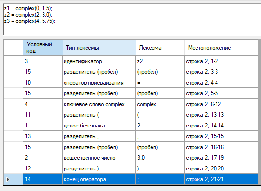
</p>

<p align="center">
  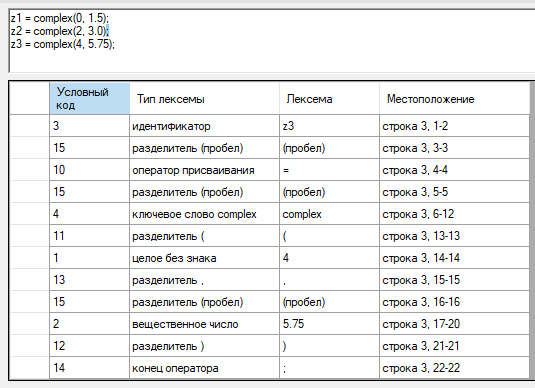
</p>


## Лабораторная работа №4: Реализация алгоритма поиска подстрок с помощью регулярных выражений
**Цель работы:** Изучить принципы работы регулярных выражений, научиться создавать шаблоны для поиска различных форматов данных, интегрировать модуль поиска в существующее приложение (текстовый редактор) и обеспечить наглядный вывод результатов с возможностью навигации.

**Постановка задачи:** Разработать модуль поиска подстрок с использованием регулярных выражений, интегрировать его в существующее приложение (текстовый редактор) и обеспечить наглядный вывод результатов.

Вариант задания 21, 12, 23
1. 21: Построить РВ, описывающее целые числа и числа с плавающей точкой (разделитель запятая).
2. 12: Построить РВ, описывающее биткоин-адрес или MultiSig биткоин-адрес.
3. 23: Построить РВ, описывающее время. Формат: ЧЧ:ММ:СС в 24-часовом формате с обязательным ведущим 0.

**Решение задачи №1:** Поиск чисел (целые и с плавающей точкой)

**Описание задачи:** Необходимо найти в тексте все числа: целые и числа с плавающей точкой, где разделителем целой и дробной части является запятая. Числа могут быть как положительными, так и отрицательными.

**Регулярное выражение:**
```
-?\d+(?:,\d+)?
```

**Пояснение обозначений**

<p align="center">
  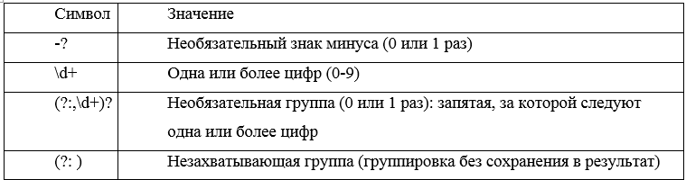
</p>

**Примеры строк, которые ДОЛЖНЫ находиться**

<p align="center">
  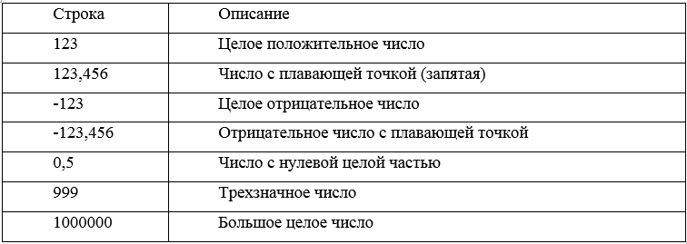
</p>

**Примеры строк, которые НЕ ДОЛЖНЫ находиться**

<p align="center">
  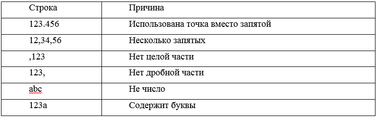
</p>

**Скриншот работы программы**

<p align="center">
  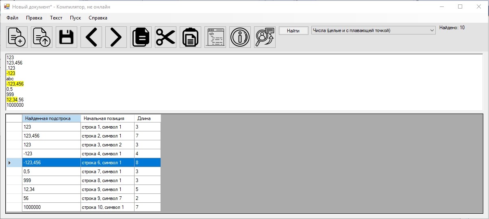
</p>

**Картинка графа автомата**

<p align="center">
  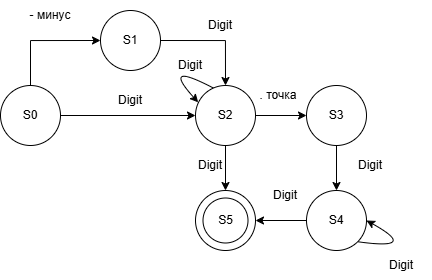
</p>

**Решение задачи №2:** Поиск биткоин-адресов

**Описание задачи:** Необходимо найти в тексте биткоин-адреса двух типов:

P2PKH (Pay-to-PubKeyHash) - начинается с символа 1

P2SH (Pay-to-Script-Hash) - начинается с символа 3

Адреса используют Base58Check кодировку (без символов 0, O, I, l) и имеют длину 25-34 символа.

**Регулярное выражение**
```
\b[13][a-km-zA-HJ-NP-Z1-9]{25,34}\b
```

**Пояснение обозначений**

<p align="center">
  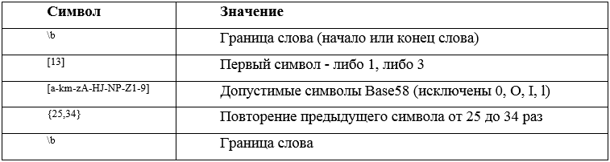
</p>

**Примеры строк, которые ДОЛЖНЫ находиться**

<p align="center">
  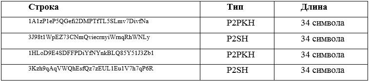
</p>

**Примеры строк, которые НЕ ДОЛЖНЫ находиться**

<p align="center">
  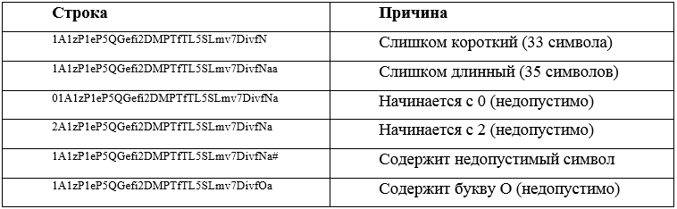
</p>

**Скриншот работы программы**

<p align="center">
  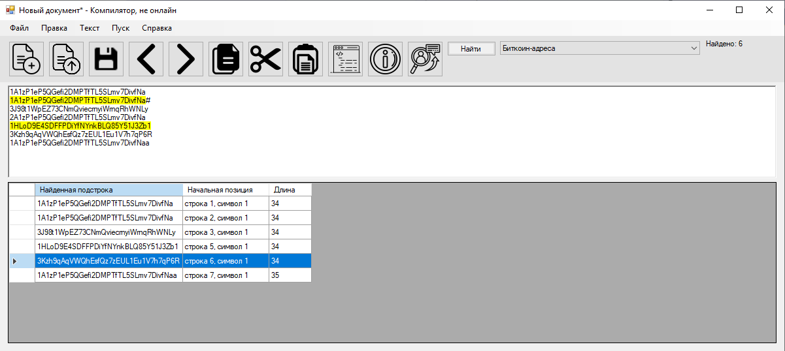
</p>

**Картинка графа автомата**

<p align="center">
  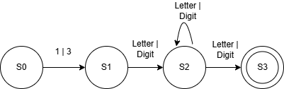
</p>

**Решение задачи №3:** Поиск времени (формат ЧЧ:ММ:СС)

**Описание задачи:** Необходимо найти в тексте время в 24-часовом формате: ЧЧ:ММ:СС, где:

ЧЧ - часы от 00 до 23 (с обязательным ведущим нулем)

ММ - минуты от 00 до 59

СС - секунды от 00 до 59

**Регулярное выражение**
```
\b(?:[0-1][0-9]|2[0-3]):[0-5][0-9]:[0-5][0-9]\b
```

**Пояснение обозначений**

<p align="center">
  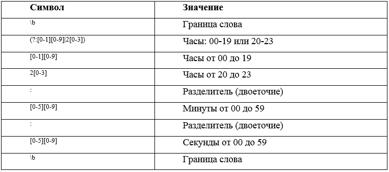
</p>

**Примеры строк, которые ДОЛЖНЫ находиться**

<p align="center">
  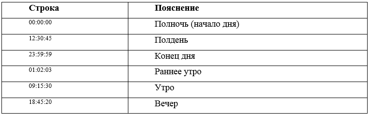
</p>

**Примеры строк, которые НЕ ДОЛЖНЫ находиться**

<p align="center">
  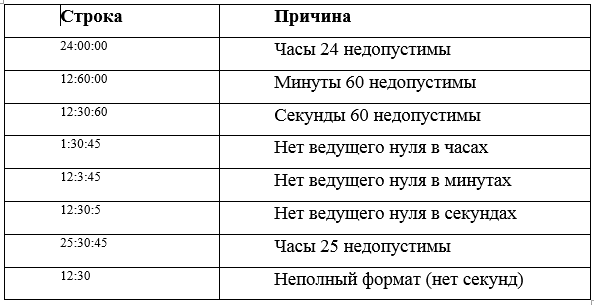
</p>

**Скриншот работы программы**

<p align="center">
  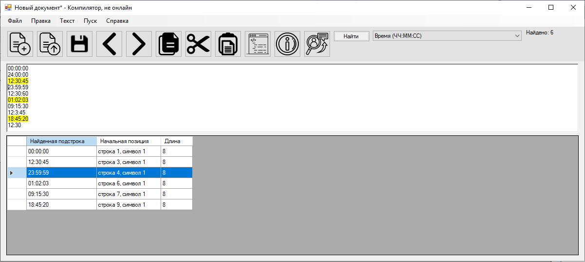
</p>

**Картинка графа автомата**

<p align="center">
  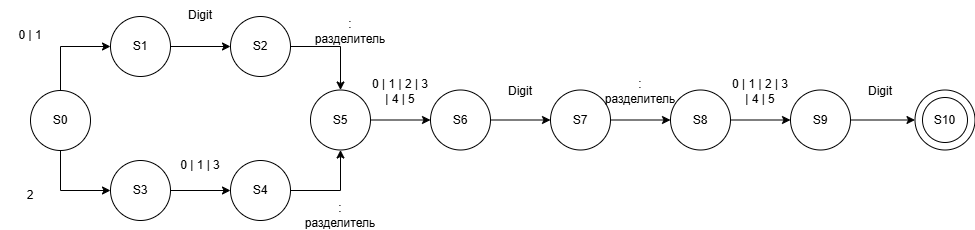
</p>
